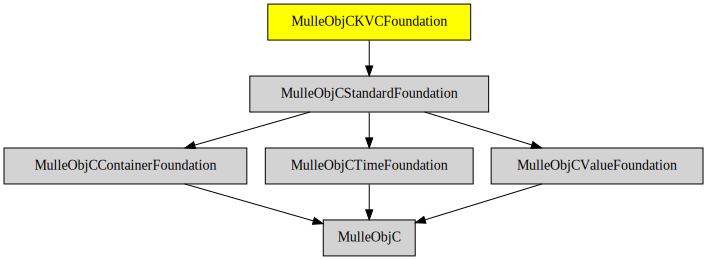

# MulleObjCKVCFoundation

#### 🔑 Key-Value-Coding based on MulleObjCStandardFoundation

Adds key-value coding to the class system. This is a runtime interpretation
scheme, so that you can write `[foo valueForKey:@"bar.baz"]` as a short-cut
for `[[foo bar] baz]` for example.

This adds a lot of methods to NSObject, NSArray, NSSet et al. via categories.

### You are here

## Install

See [foundation-developer](/MulleFoundation/foundation-developer) for
installation instructions.

## Author

[Nat!](//www.mulle-kybernetik.com/weblog) for
[Mulle kybernetiK](//www.mulle-kybernetik.com) and
[Codeon GmbH](//www.codeon.de)
